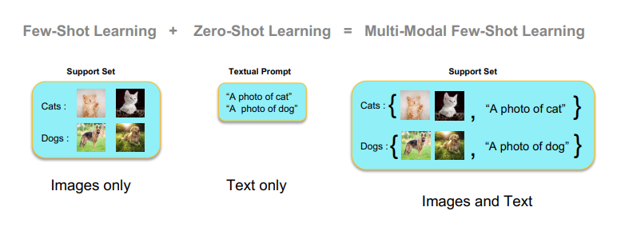
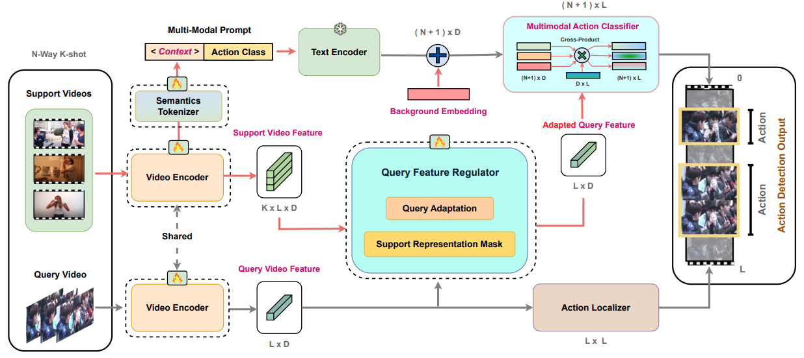

<div align="center">

<h1>Multi-Modal Few-Shot Temporal Action Detection</h1>

<div>
    <a href='https://sauradip.github.io/' target='_blank'>Sauradip Nag</a><sup>1,2,+</sup>&emsp;
    <a href='https://scholar.google.com/citations?user=be_ox9QAAAAJ&hl=en' target='_blank'>Mengmeng Xu</a><sup>4,5</sup>&emsp;
    <a href='https://scholar.google.com/citations?user=Vbvimu4AAAAJ&hl=en' target='_blank'>Juan-Manuel Perez-Rua</a><sup>5</sup>&emsp;
    <a href='https://scholar.google.co.uk/citations?hl=en&user=ZbA-z1cAAAAJ&view_op=list_works&sortby=pubdate' target='_blank'>Xiatian Zhu</a><sup>1,3</sup>&emsp;
    <a href='https://www.bernardghanem.com/' target='_blank'>Bernard Ghanem</a><sup>4</sup>&emsp;
    <a href='https://scholar.google.co.uk/citations?user=irZFP_AAAAAJ&hl=en' target='_blank'>Yi-Zhe Song</a><sup>1,2</sup>&emsp;
    <a href='https://scholar.google.co.uk/citations?hl=en&user=MeS5d4gAAAAJ&view_op=list_works&sortby=pubdate' target='_blank'>Tao Xiang</a><sup>1,2</sup>&emsp;
</div>
<div>
    <sup>1</sup>CVSSP, University of Surrey, UK&emsp;
    <sup>2</sup>iFlyTek-Surrey Joint Research Center on Artificial Intelligence, UK&emsp; <br>
    <sup>3</sup>Surrey Institute for People-Centred Artificial Intelligence, UK&emsp; <br>
    <sup>4</sup>KAUST, Saudi Arabia&emsp;
    <sup>5</sup>Meta, London&emsp;
  
</div>
<div>
    <sup>+</sup>corresponding author
</div>

<h3><strong>Under review in <a href='https://ieeexplore.ieee.org/xpl/RecentIssue.jsp?punumber=34' target='_blank'>TPAMI</a></strong></h3>

<h3 align="center">
  <a href="https://arxiv.org/abs/2211.14905" target='_blank'>Paper</a> 
</h3>

<table>
<tr>
    <td></td>
</tr>
</table>
</div>

## Updates

- (June, 2023) We released MUPPET training and inference code for ActivityNetv1.3 dataset.
- (March, 2023) MUPPET is available on Arxiv.

## Summary
- First prompt-guided framework for Any-Shot (Few-Shot/Multi-Modal Few-Shot/Zero-Shot) Temporal Action Detection task.
- Introduced a new setting of Multi-Modal Few-Shot Temporal Action Detection.
- Adapter based approach for episodic adaptation of few-shot video examples.
- First approach to show that multi-modal few-shot can be implemented using textual inversion of video examples.

## Abstract

Few-shot (FS) and zero-shot (ZS) learning are two different approaches for scaling temporal action detection (TAD) to new classes. The former adapts a pretrained vision model to a new task represented by as few as a single video per class, whilst the latter requires no training examples by exploiting a semantic description of the new class. In this work, we introduce a new multi-modality few-shot (MMFS) TAD problem, which can be considered as a marriage of FS-TAD and ZS-TAD by leveraging few-shot support videos and new class names jointly. To tackle this problem, we further introduce a novel MUlti-modality PromPt mETa-learning (MUPPET) method. This is enabled by efficiently bridging pretrained vision and language models whilst maximally reusing already learned capacity. Concretely, we construct multi-modal prompts by mapping support videos into the textual token space of a vision-language model using a meta-learned adapter-equipped visual semantics tokenizer. To tackle large intra-class variation, we further design a query feature regulation scheme. Extensive experiments on ActivityNetv1.3 and THUMOS14 demonstrate that our MUPPET outperforms state-of-the-art alternative methods, often by a large margin. We also show that our MUPPET can be easily extended to tackle the few-shot object detection problem and again achieves the state-of-the-art performance on MS-COCO dataset.

## Architecture



## Getting Started

### Requirements
- Python 3.7
- PyTorch == 1.9.0  **(Please make sure your pytorch version is atleast 1.8)**
- NVIDIA GPU
- Hugging-Face Transformers
- Detectron

### Environment Setup
It is suggested to create a Conda environment and install the following requirements
```shell script
pip3 install -r requirements.txt
```

### Extra Dependencies
We have used the implementation of [Maskformer](https://github.com/facebookresearch/MaskFormer) for Representation Masking. 
```shell script
git clone https://github.com/sauradip/STALE.git
cd STALE
git clone https://github.com/facebookresearch/MaskFormer
```
Follow the [Installation](https://github.com/facebookresearch/MaskFormer/blob/main/INSTALL.md) instructions to install Detectron and other modules within this same environment if possible. After this step, place the files in ``` /STALE/extra_files ``` into ``` /STALE/MaskFormer/mask_former/modeling/transformer/ ```. 

### Download Features
Download the video features and update the Video paths/output paths in ``` config/anet.yaml ``` file. For now ActivityNetv1.3 dataset config is available. We are planning to release the code for THUMOS14 dataset soon. 

| Dataset | Feature Backbone | Pre-Training | Link | 
|:---:|:---:|:---:|:---:|
| ActivityNet | ViT-B/16-CLIP | CLIP | [Google Drive](https://drive.google.com/drive/folders/1OFyU7V-VPHYOkTfXTQR-XxLYO-rSgL_i?usp=sharing) |
| THUMOS | ViT-B/16-CLIP | CLIP | [Google Drive](https://drive.google.com/drive/folders/16eUrTrF8-S5ncb5psIN7ikP9GweAIP_t?usp=sharing) |
| ActivityNet | I3D | Kinetics-400 | [Google Drive](https://drive.google.com/drive/folders/1B1srfie2UWKwaC4-7bo6UItmJoESCUq3?usp=sharing) |
| THUMOS | I3D | Kinetics-400 | [Google Drive](https://drive.google.com/drive/folders/1C4YG01X9IIT1a568wMM8fgm4k4xTC2EQ?usp=sharing) |

### Training Splits
Currently we support the training-splits provided by [EfficientPrompt](https://github.com/ju-chen/Efficient-Prompt) paper. Both 50% and 75% labeled data split is available for training. This can be found in ``` STALE/splits ``` 

### Model Training 
To train STALE from scratch run the following command. The training configurations can be adjusted from  ``` config/anet.yaml ``` file.
```shell script
python stale_train.py
```
### Model Inference
We provide the pretrained models containing the checkpoints for both 50% and 75% labeled data split for zero-shot setting
| Dataset | Split (Seen-Unseen) | Feature | Link | 
|:---:|:---:|:---:|:---:|
| ActivityNet | 50%-50% | CLIP | [ckpt](https://drive.google.com/file/d/1DdJYl77YkRbU9DDczvX0ojCG_tqnBr6U/view?usp=sharing) |
| ActivityNet | 75%-25% | CLIP | [ckpt](https://drive.google.com/drive/folders/16eUrTrF8-S5ncb5psIN7ikP9GweAIP_t?usp=sharing) |

After downloading the checkpoints, the checkpoints path can be saved in ``` config/anet.yaml ``` file.
The model inference can be then performed using the following command 
```shell script
python stale_inference.py
```
### Model Evaluation
To evaluate our STALE model run the following command. 
```shell script
python eval.py
```
### TO-DO Checklist
- [ ] Fix the learnable-prompt issue in Huggig-Face Transformer
- [x] Fix the NaN bug during Model-Training
- [ ] Support for THUMOS14 dataset
- [x] Enable multi-gpu training

### Acknowledgement
Our source code is based on implementations of [DenseCLIP](https://github.com/raoyongming/DenseCLIP), [MaskFormer](https://github.com/facebookresearch/MaskFormer) and [CoOP](https://github.com/kaiyangzhou/coop). We thank the authors for open-sourcing their code. 
## Citation
If you find this project useful for your research, please use the following BibTeX entry.
```
@article{nag2022multi,
  title={Multi-Modal Few-Shot Temporal Action Detection via Vision-Language Meta-Adaptation},
  author={Nag, Sauradip and Xu, Mengmeng and Zhu, Xiatian and Perez-Rua, Juan-Manuel and Ghanem, Bernard and Song, Yi-Zhe and Xiang, Tao},
  journal={arXiv preprint arXiv:2211.14905},
  year={2022}
}
```


